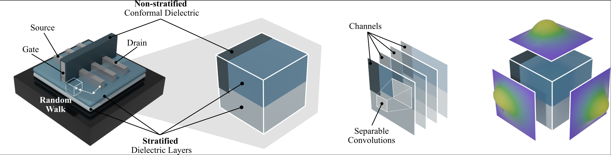

# DeepRWCap: Neural-Guided Random-Walk Capacitance Solver for IC Design

DeepRWCap is a machine learning-guided random walk solver that accelerates capacitance extraction by predicting the transition quantities required to guide each step of the walk. This repository contains the implementation described in the paper "DeepRWCap: Neural-Guided Random-Walk Capacitance Solver for IC Design."



## Index
- [Prerequisites](#prerequisites)
- [Datasets](#datasets)
- [Python Training](#python-training)
- [C++ Inference](#c-inference)
- [DeepRWCap](#deeprwcap)

## Prerequisites
- Python 3.10+
- CUDA 12.6+ (for GPU support)
- CMake 3.18+
- GCC/G++ compiler

Containerized approach (run the container in shell mode with the `/workspace` binding):
```bash
singularity pull pytorch-24.12-py3.sif docker://nvcr.io/nvidia/pytorch:24.12-py3
singularity shell --nv --bind /path/to/deepRWCap:/workspace pytorch-24.12-py3.sif
```

Note: Replace `/path/to/deepRWCap` with the actual path to your repository directory. The bind mount makes the repository contents available inside the container at `/workspace`.

## Python Training

### Datasets

> [!WARNING]
> Check the [GGFT documentation](ggft/README.md) to generate the training datasets using a finite difference method for model training. Alternativelly, use the provided script `cd ggft` and `source run_ggft.sh`.

Each dataset file is a binary file with the following format:
**Header** (2 values):
- `N`: Grid resolution (e.g., 16, 21, 23)
- `block_w`: Block width parameter (set to 1)

**Body** (repeated samples):
Each sample contains:

- Dielectric data: `N³` values representing the permittivity distribution
- Structure data: `7 × n_structures` values (geometric structure parameters, unused)
- Poisson[^1]/Gradient data: `6 × N²` values for the 6 faces of the cube

[^1]: The surface Green's function is equivalent to the Poisson kernel.

### Setup

Install the core dependencies on the container with:
```bash
pip install -r requirements.txt
```

Note: The requirements.txt is configured for PyTorch 2.6+ with CUDA 12.6 support (supported by the recommended container). If you are using a different CUDA version, you may need to install PyTorch separately following the [official PyTorch installation guide](https://pytorch.org/get-started/locally/).

### Features

`pytorch_training/main.py` manages training and optimization of the presented models using PyTorch and TensorRT.

- Trains multiple predefined models on GPU(s) with multiprocessing
- Automatically measures FLOPs and parameter counts
- Exports best models in TorchScript format
- Benchmarks and compiles models with TensorRT (FP32 & FP16)
- Reports latency and throughput improvements after compilation


### Usage

```bash
python pytorch_training/main.py [train] [compile]
```

- `train` → Run training only
- `compile` → Run TensorRT compilation only
- `No arguments` → Run both training and compilation

Model configurations and datasets are predefined in the script (see `MODELS_TO_TRAIN` and `DATASET_BASE_CONFIGS`).

### Outputs

- Trained models saved in: `/workspace/models/`
- Logs saved in: `/workspace/runs/`


## Compiling the C++ Inference Library

The C++ backend provides high-performance inference using LibTorch and TensorRT with CUDA acceleration.

### Build
The library for dynamic linking will be created in `inference_cpp/build/lib/dnnsolver.so`. 

```bash
unset CUDACXX
cd inference_cpp
mkdir build && cd build
cmake ..
make -j$(nproc)
```

Note: The DeepRWCap binary expects `dnnsolver.so` to be in the `/workspace/deepRWCap_bin` directory. 

## DeepRWCap

### Setup 
1. Activate the Singularity container. 

2. Make sure that the `dnnsolver.so` and `models.txt` files are inside the `deepRWCap_bin` directory.

3. To ensure correct CUDA Stream synchronization, ensure the system is using a single GPU with `export CUDA_VISIBLE_DEVICES=0`.

### Direct Usage

To run a capacitance extraction task directly use:
```bash
./bin/rwcap --walk-type SS -f <input_file.cap3d> -n <num_cores> [accuracy_options]
```
Required Arguments:
- `--walk-type SS`: Specifies the random walk algorithm
- `-f <input_file.cap3d>`: Input file containing the 3D capacitance structure definition
- `-n <num_cores>`: Number of CPU cores to use for parallel processing

Accuracy Control Options:
- `-p <value>`: Convergence threshold for self-capacitance
- `-c <value>`: Convergence threshold for capacitance matrix
- `--c-ratio <value>`: Fraction of the capacitance matrix elements that must meet the convergence threshold.

Example:
```bash
./bin/rwcap --walk-type SS -f /workspace/testcases/cap3d/case3.cap3d -n 16 -p 0.01 -c 0.01 --c-ratio 0.95
```
Expected output files:
- `case3.cap3d.out`: Capacitance extraction results
- `case3.cap3d.log`: Detailed execution log


### Scripted Usage

To replicate the capacitance extraction results from the paper use the python script `run_script.py`. It provides:

- **Automated testing**: Runs each test case multiple times for statistical analysis
- **Multi-core scaling**: Tests performance across different core counts (1, 2, 4, 8, 16 cores)
- **Error analysis**: Computes relative errors against reference solutions

```bash
python run_script.py <number_of_runs> [test_cases...]
```

Parameters:
- `<number_of_runs>`: Number of iterations per test case (e.g., 10)
- `[test_cases...]`: Optional list of test cases (`case1`, `case2`, etc.) or `all` for all cases

Example:

```bash
python run_script.py 10 all
```

